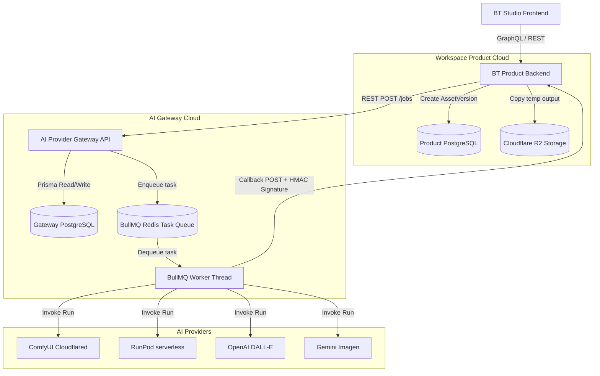

# System Architecture: AI Provider Gateway

This document outlines the high-level system architecture and execution pipelines for the isolated `BT-Studio-AI-Provider-Gateway` service.

## Core Objective
Decouple AI provider configuration, API JSON workflow bindings, retry logic, active polling threads, and gateway credentials from the main BT Studio product backend and PostgreSQL database.

## System Topology Diagram

## Data Lifecycle Isolation

### Product Backend
Owns core application tables:
- `User`
- `Project`
- `Folder`
- `Asset`
- `AssetVersion`
- `Comment`
- `ActivityLog`
- Final asset storage credentials (Cloudflare R2)

### AI Provider Gateway
Owns AI execution tables:
- `ProviderConfig`
- `AIWorkflow` (slug, activeVersionId)
- `AIWorkflowVersion` (ComfyUI API JSON configs)
- `GatewayJob` (temporary enqueued status, inputs, progress)
- `GatewayJobLog` (real-time diagnostics)

The gateway **never** queries the Product Backend database, nor does it write files directly to Cloudflare R2. Instead, it uploads images temporarily to the AI Provider, performs processing, returns a signed JSON callback with a temporary output URL, and relies on the Product Backend to fetch and copy the final output asset to its permanent R2 bucket.
